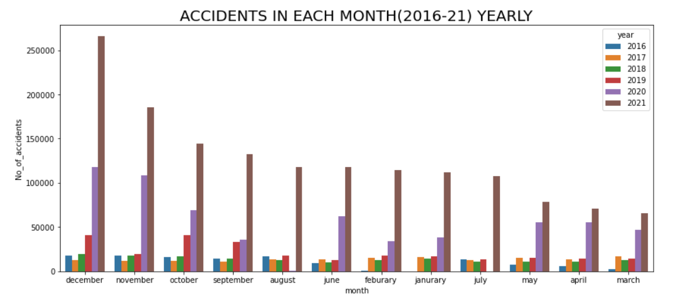
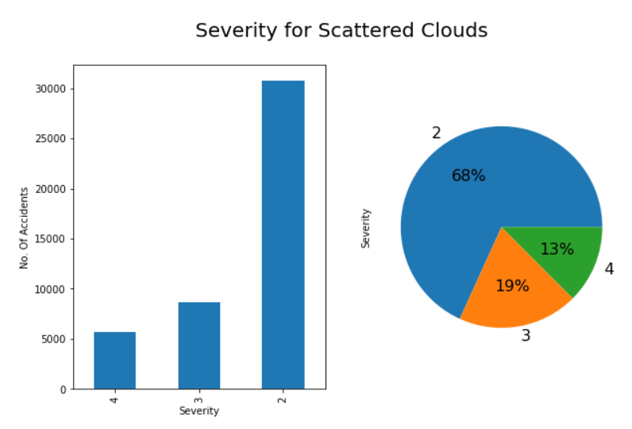

# EDA-on-US-Accidents-2016-2021


## What is Exploratory Data Analysis(EDA)?
**EDA** means trying to understand the given data much better, so that we can make some sense out of it.


In statistics, exploratory data analysis is an approach to analyzing data sets to summarize their main characteristics, often with visual methods. A statistical model can be used or not, but primarily EDA is for seeing what the data can tell us beyond the formal modeling or hypothesis testing task :wink:.
You can find a more formal definition on [Wikipedia](https://en.wikipedia.org/wiki/Exploratory_data_analysis).


## About Dataset - US Accidents(2016-2021)

### Dataset Description
This is a countrywide car :car: accident dataset, which covers 49 states of the USA. The accident data are collected from **February 2016 to Dec 2021**, using multiple APIs that provide streaming traffic incident (or event) data. These APIs broadcast traffic data captured by a variety of entities, such as the US and state departments of transportation, law enforcement agencies, traffic cameras, and traffic sensors within the road-networks. Currently, there are about 2.8 million accident records in this dataset.

The dataset is available publicly on *Kaggle* Website. You can access or download the dataset from [here](https://www.kaggle.com/datasets/sobhanmoosavi/us-accidents?datasetId=199387&sortBy=voteCount).


## Content
**US Accidents(2016-2021) Dataset - EDA:**  Exploratory Data Analysis of the accidents occured in differents streets, cities, states of US. The weather conditions at the most of the time of the accidents, the severity, time analysis all of these things are analysed and visualized in this notebook. Some important insights are also derived based on the data visualization.


## Instructions for Running Python Notebooks Locally
 
 - Install the required libraries in your Virtual Environment.

 - Run notebooks as usual by using a jupyter notebook server, Vscode etc.


## Libraries to Install
    
:white_check_mark: **Numpy** : [Numpy Installation](https://numpy.org/install/)

:white_check_mark: **Pandas** : [Pandas Installation](https://pandas.pydata.org/docs/getting_started/index.html)

:white_check_mark: **Matplotlib** : [Matplotlib Installation](https://matplotlib.org/stable/users/getting_started/)

:white_check_mark: **Seaborn** : [Seaborn Installation](https://seaborn.pydata.org/installing.html)

:white_check_mark: **Plotly** : [Plotly Installation](https://plotly.com/python/getting-started/)

:white_check_mark: **Chart-Studio** : [Chart-Studio Installation](https://plotly.com/python/getting-started-with-chart-studio/)


## Project Notebook

You can install Jupyter Notebook Environment from [here](https://jupyter.org/install) or through the [Anaconda Distribution](https://www.anaconda.com/products/distribution) or, can even use any IDE you like.

You can access the **Project Notebook** from [here](https://github.com/Deeshu-Jain/US_ACCIDENTS_2016-2021_EDA/blob/main/EDA%20on%20US%20Accidents%20(2016%20-%202021).ipynb).


## Code Snippet

```python
# Visualizing the top 5 States
plt.figure(figsize=(10,7))
sns.barplot(x="State",y="No_of_accidents",data=top_states[-5:])
plt.title("TOP 5 STATES WITH HIGHEST NUMBER OF ACCIDENTS",fontsize=20)
plt.show()
```


## Screenshots
Includes Screenshots of Some Visualization Figures/Plots







## Support My Work :wink:
You can feel free to comment on my projects, find the bugs :mag_right: or tell me what your thoughts about my coding, analysis and insight. You can also take some codes away if you think some of them can be useful for your projects :computer:. 
If you liked what you saw :blush:, want to have a chat with me about the portfolio, work opportunities, or collaboration, shoot :gun: an email at djjain844@gmail.com.

You can check out my portfolio here :v:.
